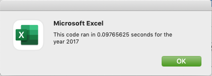
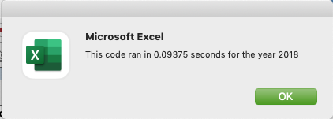

# Stocks Analysis Refactor

## Purpose
Refactor the stocks analysis workbook prepared for Steve so that the module runs efficiently.

## Challenge
Iterate through all rows and perform all neccessary calculations using fewest steps to improve performance and execution time.

## Solution
Instead of running a loop to calculate each value ( TickerVolume, StartingPrices and EndingPrices ) which would result in roughly 12,000 iterations, code has been refactored to calculate all values inside one single loop. By performing neccessary calculations to determine current stock's TickerVolume, StartingPrices and EndingPrices all in one loop we were able to complete the macro in a fraction of the time if we were to run the loop four times.

## Results

#### [Download Stocks_Analysis XLSM](VBA_Challenge.xlsm)
